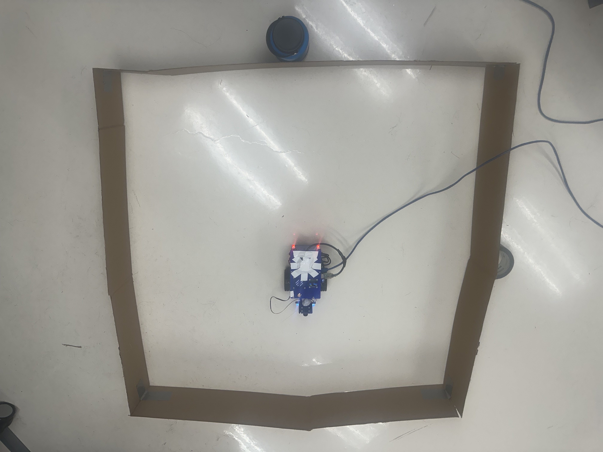
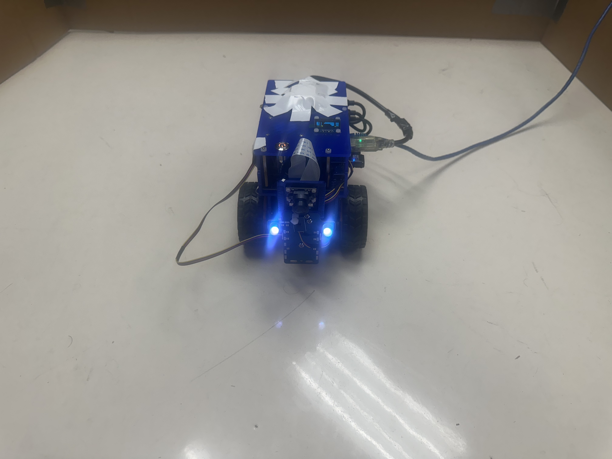

The below video shows the estimator in action on the robot. 


The ROS shell shows the state estimate of the robot in [x, y, theta] coordinates, where \[0, 0, 0\] corresponds to the center of the box facing the top.

More pictures of the Duckiebot are shown below.
Top view of robot in box:

Front view of Duckiebot:

We see that the state estimator responds to the robot being moved, and reflects the correct coordinates of its pose in the box. 