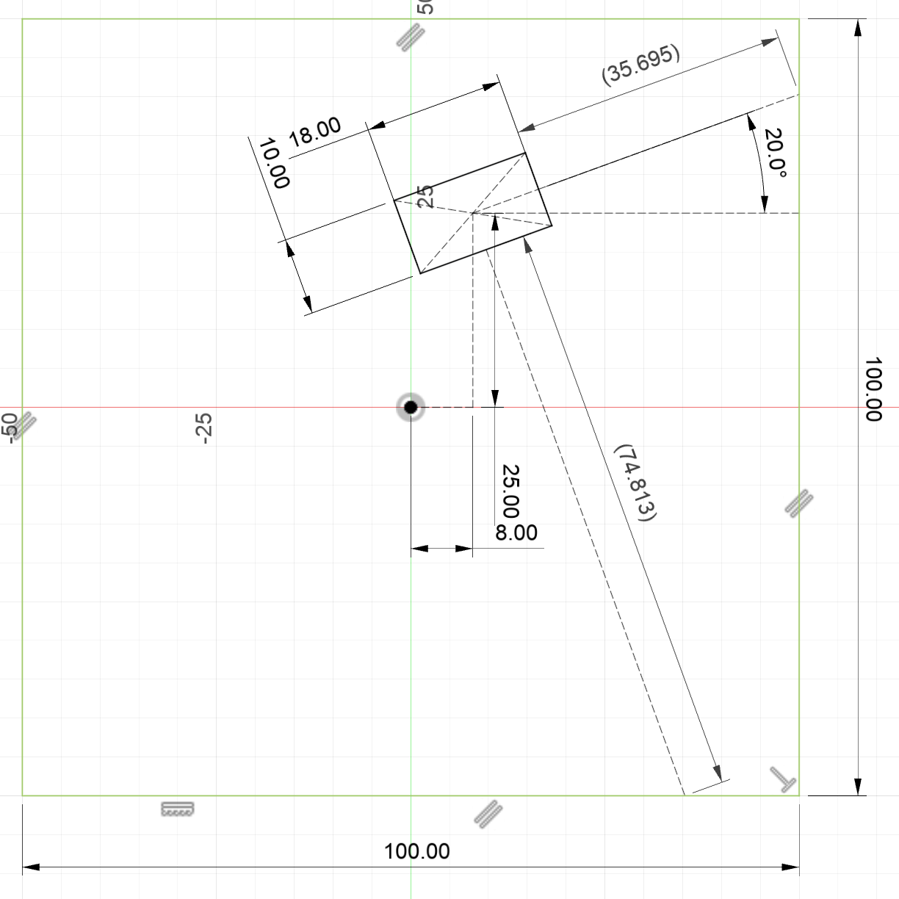

# State Estimator Design

The state estimation algorithm used for this problem was the particle filter [1]. This was chosen to deal with the multi-modal nature of the probability distributions in our problem, as the sensors do not uniquely pin down our state. By having a cloud of particles, we are more likely to estimate the correct pose in the box. 

The prediction step involved simple vehicle dynamics, where simple first order dynamics are used to propagate linear and angular velocity inputs. In other words, we get that x_t = x_t-1 + v\*dt, where dt is the time step used. 

The challenge is in the correction/resampling step. Essentially the idea is to calculate what the ToF sensor readings _would_ be for the specific pose that each particle is in, and use the actual ToF readings to calculate conditional probabilities. This way, the robot does not have to deal with complex state vectors involving previous state memory to be able to estimate where it is.

This function to generate ToF readings based on the robot pose turned out to be quite complicated, and it is implemented in the ```get_theoretical_tof``` function in the particle filter ROS node. This code can be found on [GitHub](https://github.com/dherreravicioso/e205-robot-in-a-box/tree/v3/packages/my_package/src), specifically in the packages/my_package/src directory.

At a high level, the function calculates the two expected ToF readings separately. For each ToF reading, we begin by determining which wall the ToF measurement is based on, the wall that it is pointed at. This is done by projecting the vector from the robot's center to the relevant side wall (either left or right), then checking whether the projected point is within the upper and lower bounds of the box. If it is, then the ToF is pointed at the side wall, otherwise it is pointed at the upper or lower wall. This part of the function requires different formulas for checking depending on which quadrant the robot is pointed at. Once the wall is determined, a formula, derived specifically for ToF readings on that wall, is used to calculate the expected ToF measurement. This process is first done for the ToF pointing in the x direction, then is repeated for the y direction, by rotating the angle 90 degrees and repeating the process to find the y ToF measurement.

To validate this function, we gave test vectors and verified the distance outputs by simulating the scenario in Fusion 360. An example is shown below.


In addition, the state estimator parameters had to be tuned. The Gaussian noise injected into the state vector had a standard deviation of 0.1, such that the particles were able to spread enough to cover neighboring cases of non-unique sensor input. The number of particles used was 100, which resulted in better estimator performance at the cost of computational resources. 