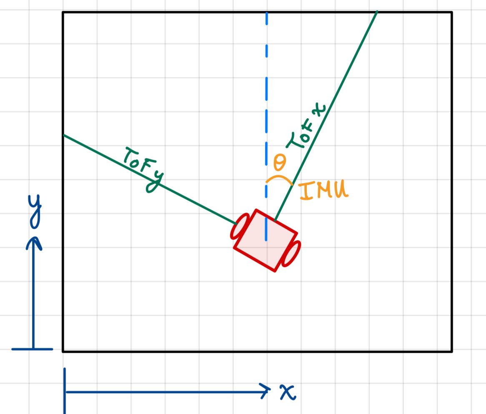
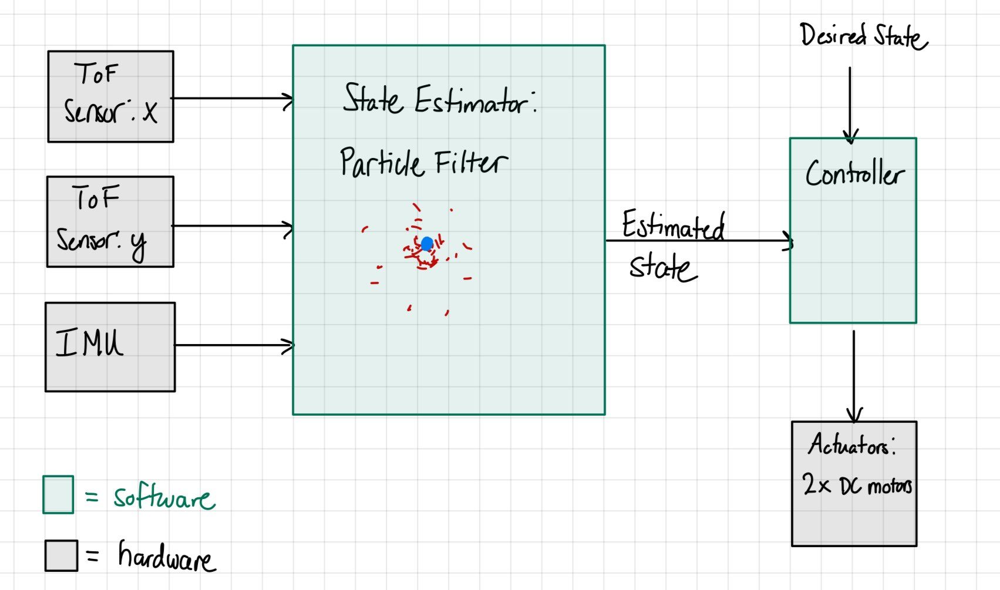

# Project Abstract

This project aimed to explore state estimation techniques in the real world with real hardware. This project used the [Duckietown](https://duckietown.com/) autonomous robotics platform as a hardware basis. This project is for E205: State Estimation at HMC.

  

# Introduction
This project planned on implementing a state estimation algorithm to track a robot's position in a box. The difficulty here is that we limited ourselves to three sensors for localization: two time of flight (ToF) distance sensors, and one Inertial Measurement Unit (IMU). The two ToF sensors were mounted perpendicular to each other, and the IMU provided a yaw reading. The sensors used were the VL53L0X ToF sensors, one of which comes stock on the Duckiebot. The IMU used was borrowed from HMC's MuddSub program, as the IMU that comes stock on the Duckiebot is a 6-axis IMU with no magnetometer, meaning there is no accurate heading information present. This IMU is the VectorNav VN100, which is far too nice for this type of project. 

The goal is to place a robot in a square box and have it be able to localize within this box. By mounting the ToF sensors perpendicularly, it seems as if the robot should be able to uniquely estimate it's pose inside the box, but it turns out that this is not true. If the robot is close to a wall and at an angle, then both ToF sensor beams land on the same wall, and thus the robot cannot distinguish where it is from any other point that is the same distance but along the wall. So, the chakkenge comes in being able to determine where the robot is inside the box despite this restriction on sensing. 

The below diagram shows how the robot plans to localize inside the box.

# System Block Diagram

The estimated state contains the x and y positions as well as yaw in the global box frame. 
